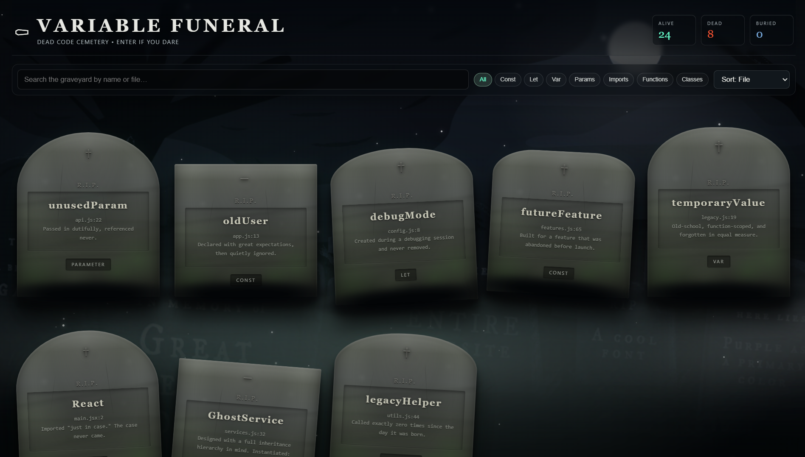
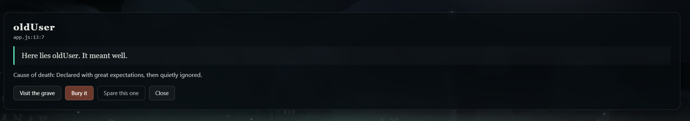

# Variable Funeral ⚰️💀

> **Because some variables deserve a proper burial.**

## Basic Details

### Team Name: [KARIVEPPILA]

### Team Members

* **Team Lead:** Muhammed Badusha K T - Cochin University College of Engineering Kuttanad (CUCEK)
* **Member 2:** ADHITHYAN - Cochin University College Of engineering Kuttanad

### Project Description

**Variable Funeral** is a VS Code extension that finds unused variables, functions, parameters, imports, and other declarations in your code and gives them a proper digital funeral.

Instead of boring warnings, dead code gets transformed into a hilarious interactive **Graveyard**, complete with tombstones, causes of death, epitaphs, and the ability to bury or resurrect your code.

### The Problem (that doesn't exist)

Developers already have linters and compiler warnings telling them that something is unused.

But where is the **respect**?

An unused variable can spend months sitting inside a codebase doing absolutely nothing. It deserves closure.

### The Solution (that nobody asked for)

We built a digital cemetery for dead code.

Variable Funeral analyzes your code, identifies declarations that appear to be unused, and sends them to the Graveyard where every piece of dead code receives:

* 🪦 Its own tombstone
* 💀 A cause of death
* ✍️ A ridiculous epitaph
* 📍 Its source location
* ⚰️ A burial system
* 🧟 A resurrection option

Because deleting unused code is too normal.

---

# Technical Details

## Technologies/Components Used

### For Software:

* **Languages:** TypeScript, JavaScript, HTML, CSS
* **Frameworks/Platforms:** VS Code Extension API
* **Libraries:** TypeScript Compiler API
* **Frontend:** HTML, CSS, JavaScript
* **Extension UI:** VS Code Webview
* **Tools:** Visual Studio Code, Node.js, npm, Git, GitHub

### Core Technologies

**TypeScript AST**

Used to analyze source code and identify declarations such as:

* Variables
* Functions
* Parameters
* Imports
* Other declarations

**VS Code Extension API**

Used to integrate Variable Funeral directly into VS Code and provide commands, diagnostics, and the interactive Graveyard.

**Webview**

Used to create the visual Graveyard interface containing interactive tombstones and animations.

---

# Implementation

## For Software:

The extension works in several stages:

```text
Source Code
     │
     ▼
TypeScript AST Analysis
     │
     ▼
Find Declarations
     │
     ▼
Check References
     │
     ▼
Identify Unused Code
     │
     ▼
Generate Graveyard Records
     │
     ▼
Interactive VS Code Webview
     │
     ▼
⚰️ Variable Funeral Graveyard
```

Each detected unused declaration is represented as a grave in the Graveyard.

The user can inspect the declaration, view its source location, bury it, spare it, or resurrect it.

---

# Installation

Clone the repository:

```bash
git clone https://github.com/YOUR_USERNAME/variable-funeral.git
```

Navigate to the extension:

```bash
cd variable-funeral/extension
```

Install dependencies:

```bash
npm install
```

Compile the extension:

```bash
npm run compile
```

Open the extension folder in VS Code:

```bash
code .
```

Press:

```text
F5
```

This launches the **Extension Development Host**.

---

# Run

1. Open the project in VS Code.
2. Press `F5`.
3. A new **Extension Development Host** window will open.
4. Open a JavaScript or TypeScript file.
5. Open the Command Palette:

```text
Ctrl + Shift + P
```

6. Run:

```text
Variable Funeral: Scan Current File
```

7. Open the Graveyard:

```text
Variable Funeral: Open Graveyard
```

8. Visit the graves of your abandoned variables. ⚰️

---

# Project Documentation

## Screenshots

### 1. Variable Funeral Graveyard



*The interactive Graveyard displaying unused declarations as tombstones.*

### 2. Grave Details



*An individual grave showing the declaration, cause of death, epitaph, and available actions.*

### 3. VS Code Extension


*Variable Funeral running directly inside the VS Code Extension Development Host.*

> **Note:** Replace the image paths above with your actual screenshots before submitting the final repository.

---

# Diagrams

## Workflow


*Variable Funeral analyzes source code, detects potentially unused declarations, and presents them as an interactive Graveyard inside VS Code.*

```text
┌──────────────────┐
│    Source Code   │
└────────┬─────────┘
         │
         ▼
┌──────────────────┐
│ TypeScript AST   │
│    Analyzer      │
└────────┬─────────┘
         │
         ▼
┌──────────────────┐
│ Find Candidate   │
│   Declarations   │
└────────┬─────────┘
         │
         ▼
┌──────────────────┐
│ Reference Check  │
└────────┬─────────┘
         │
         ▼
┌──────────────────┐
│ Unused Code      │
│    Detected      │
└────────┬─────────┘
         │
         ▼
┌──────────────────┐
│ Graveyard Data   │
└────────┬─────────┘
         │
         ▼
┌──────────────────┐
│ VS Code Webview  │
└────────┬─────────┘
         │
         ▼
       ⚰️
   VARIABLE
   FUNERAL
```

---

# Project Demo

## Video

demo\media\demo.mp4

---

# Additional Demos

### 🌐 Interactive Web Demo

A browser-based demonstration of the Variable Funeral Graveyard is available through the project's demo website.

[Add GitHub Pages demo link here]

### 💻 VS Code Extension

The complete VS Code extension source code is included in the repository under:

```text
extension/
```

---

# Team Contributions

* **Muhammed Badusha K T:** Project concept, VS Code extension development, TypeScript analysis, Graveyard UI, webview implementation, testing, and integration.
* **[Adhithyan]:** [Came as a usless feature ]

---

## ⚰️ Final Note

Variable Funeral doesn't solve a problem that developers were desperately waiting to solve.

It simply asks an important question:

> **If unused code is dead... why shouldn't it have a funeral?**

**Rest in peace, `unusedVariable`.**

**You were declared. You were never used.**
